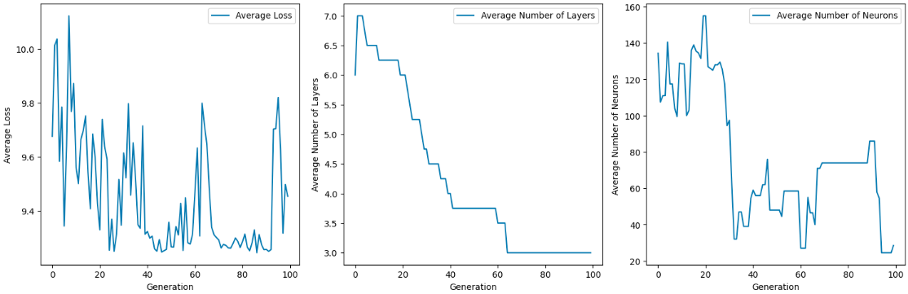

# Genetic Neural Network Optimization

This project explores the use of **genetic algorithms** to optimize the architecture of **neural networks**. The goal is to find the smallest and most efficient neural network structure that performs well on a given dataset, balancing accuracy and computational efficiency.

---

## Genetic Algorithms

Genetic algorithms are inspired by natural selection, where the best solutions evolve over generations. In this project, we use genetic algorithms to optimize the architecture of neural networks. The key components of our genetic algorithm are:

1. **Population**: A set of neural network architectures, represented as lists of layer sizes (called DNAs).
2. **Crossover**: Combining two DNAs to create a new architecture.
3. **Mutation**: Randomly modifying a DNA to introduce diversity.
4. **Fitness**: Evaluating the performance of each architecture.

### Example Neural Network from DNA

### Crossover Example
The Crossover can be understood using the following figure :

### Results 
Evolution of neural network in 100 generations with 10 neural networks in each population.

